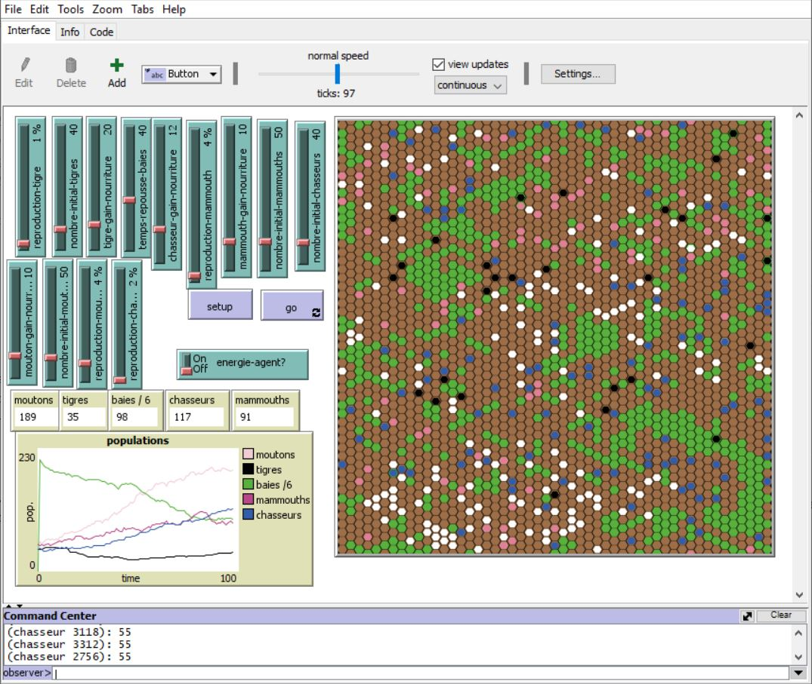

## DESCRIPTIF DU PROJET
==>Ce modèle explore la stabilité d'une chaine alimentaire préhistorique, où chaque espèce, ayant sa propre dynamique (reproduction, mode d'alimentation, espérance de vie), arrive à survivre sans etre décimée au bout de quelques pas de temps ,dans une grande vallé,composée de plusieurs agents:

    -des chasseurs/cueilleurs
    -des mammouths
    -des tigres à dents de sabre
    -des moutons
    -des baies et de végétation

==>L'écosystèmes prédateurs-proies, est décrit comme suit:

    -Les chasseurs et les cueilleurs sont omnivores ( baies et viande).
    -Les tigres se nourissent de chasseurs, de mammouths et de moutons. 
    -Les mammouths et les moutons sont herbivores.

## MODELISATION

==> Les 4 agents ( Chesseurs, mammouths, Tigres, Moutons) sont modélisés par 4 types de "tortues" (turtles).
==> Chaque agent est décrit par une couleur précise, ce qui permettera d'élargir facilement la chaine alimentaire, en ajoutant d'autres agents avec simplement d'autres couleurs.

    -Chasseurs ---> couleur bleu
    -Mammouths ---> couleur rose
    -Tigres    ---> couleur noir
    -Moutons   ---> couleur blache

==> Alors que les Baies sont modélisés par un patch vert.

## PARAMETRES
   
  **_INITIALISATION_** :

    -Nombre-initial-moutons:La taille initiale de la population des moutons 
    -Nombre-initial-mammouths:La taille initiale de la population des mammouths 
    -Nombre-initial-tigres:La taille initiale de la population des tigres
    -Nombre-initial-chasseurs:La taille initiale de la population des chasseurs

  **_GAIN ALIMENTAIRE_**

    -Mouton-gain-nourriture: La quantité d'énergie que les moutons obtiennent pour chaque
     champ d'herbe mangé 
    -Mammouth-gain-nourriture: La quantité d'énergie que les mammouths obtiennent pour
     chaque champ d'herbe mangé 
    -Tigre-gain-nourriture: La quantité d'énergie que les tigres obtiennent en mangeant  
     un mouton, un mammouth ou un champ d'herbe.
    -Chasseur-gain-nourriture: La quantité d'énergie que les chasseurs obtiennent en 
      mangeant un mouton, un mammouth ou des baies.

  **_REPRODUCTION_**
  
    -Reproduction-mouton:La probabilité qu'un mouton se reproduit à chaque pas de temps
    -Reproduction-mammouth:La probabilité qu'un mammouth se reproduit à chaque pas de
     temps
    -Reproduction-tigre:La probabilité qu'un tigre se reproduit à chaque pas de temps
    -Reproduction-chasseur:La probabilité qu'un chasseur se reproduit à chaque pas de
     temps
    -Temps-repousse-baies: le temps necessaire pour que l'herbe repousse une fois qu'elle
     est mangée

  **_NIVEAU D'ENERGIE_**

    -Energie-Agent: Montre ou Cache le niveau d'énergie de chaque agent en chiffres.

## MODE DE FONCTIONNEMENT

    -Les 4 races se promènent aléatoirement dans le paysage, tandis que les tigres
     recherchent des moutons, des mamouths , des chasseurs et des baies pour se
     nourrir,ils perdent de l'énergie, qui se recompense en trouvant une proie.
    -Les baies et végetations maintiennent la couleur verte tant qu'ils ne sont pas
     encore mangés.
    -Les moutons et les mammouths doivent manger de l'herbe pour maintenir leur énergie,
     que la recherche consomme.
    -Les chasseurs recherchent des moutons, des mamouths ,et des baies pour se nourrir,
     ils perdent de l'énergie, qui se recompense en trouvant une proie.
    -Les agents meurent lorsqu'ils manquent d'énergie, ou soient mangés par un prédateur.

## REMARQUES 
  
   -Le role de chaque agent dans la chaine alimentaire justifie le choix de la taille de sa population initiale.
   -le programme avec les valeurs de parametres fixées par defaut, assure la stabilité de la chaine:  
              Tigre -->Chasseurs --> baie.

## REFERENCES
[Netlogo web page](https://ccl.northwestern.edu/netlogo/)

[Wolf Sheep Predation](https://ccl.northwestern.edu/netlogo/models/WolfSheepPredation)

[Netlogo Tutorial](https://www.youtube.com/watch?v=XJ-gO-yAwHU&list=PL8AF794C0800A6A73)

**_BOUMLIK OUMAIMA_**      